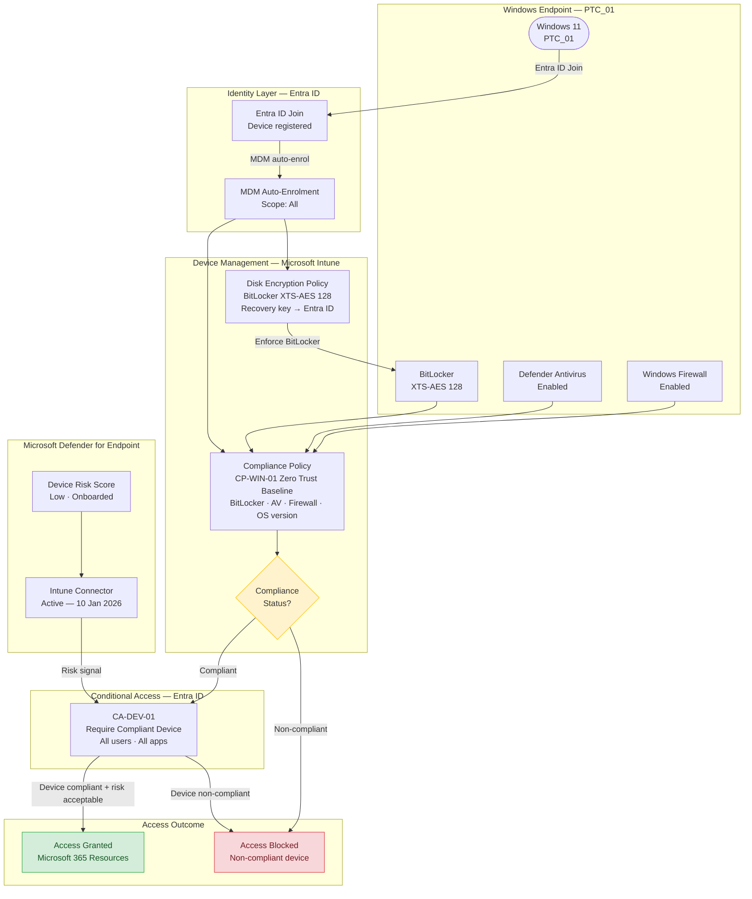

# Project 2 — Zero Trust Device Trust Enforcement

[](https://learn.microsoft.com/en-us/mem/intune/)
[](https://learn.microsoft.com/en-us/microsoft-365/security/defender-endpoint/)
[](https://learn.microsoft.com/en-us/entra/identity/conditional-access/)
[](https://learn.microsoft.com/en-us/windows/security/operating-system-security/data-protection/bitlocker/)
[](https://learn.microsoft.com/en-us/security/zero-trust/)
[](https://learn.microsoft.com/en-us/powershell/)

## Business Problem

Project 1 established that **identity alone cannot be trusted** — every user must prove who they are via MFA and risk-based Conditional Access. But identity is only half the equation.

A fully authenticated user on a compromised, unencrypted, or unmanaged device still represents a significant threat:
- Unmanaged device = no visibility into device health
- No BitLocker = data exposed if device is lost or stolen
- No Defender = no endpoint threat detection
- No compliance check = CA policies cannot evaluate device posture

**An attacker with valid credentials on a personal or compromised device bypasses every identity control.**

## Business Requirement

Only **managed, compliant, and actively monitored** Windows devices should be permitted to access organisational Microsoft 365 resources. Device health must be evaluated at every access request — not just at enrolment time.

## Microsoft Solution

| Requirement | Solution |
|---|---|
| Device inventory and management | Microsoft Intune (MDM) |
| Compliance baseline enforcement | Intune Windows Compliance Policy |
| Disk encryption at rest | Intune Endpoint Security — Disk Encryption (BitLocker) |
| Endpoint threat detection | Microsoft Defender for Endpoint |
| Access enforcement | Conditional Access — Require Compliant Device (CA-DEV-01) |

## Outcome

Device `PTC_01` enrolled, compliance policy applied (initially **Noncompliant** → BitLocker remediated → **Compliant**), Defender for Endpoint connected, and `CA-DEV-01` enforced. Non-compliant devices are blocked from all Microsoft 365 resources at the Conditional Access layer.

---

## Objectives

- Enrol a Windows endpoint into Intune via Entra ID Join and MDM auto-enrolment
- Define a minimum device compliance baseline (BitLocker, Antivirus, Firewall, OS version)
- Deploy BitLocker via Intune Disk Encryption (Endpoint Security) with recovery key escrow to Entra ID
- Connect Microsoft Defender for Endpoint to Intune for risk-based device signals
- Enforce compliant device requirement via Conditional Access policy CA-DEV-01
- Validate the full compliance and enforcement cycle

---

## Lab Environment

| Item | Detail |
|---|---|
| Tenant | Patchthecloud.onmicrosoft.com |
| Test device | PTC_01 (Windows 10.0.22631.6199 — Windows 11 23H2) |
| Test user | WillStone@Patchthecloud.onmicrosoft.com |
| Device ownership | Personal (BYOD scenario) |
| License | Microsoft 365 Business Premium |
| MDM scope | All users |
| Compliance policy | CP-WIN-01 – Zero Trust Baseline |
| Disk encryption policy | Disk encryption (BitLocker XTS-AES 128) |
| CA policy | CA-DEV-01 – Require Compliant Device |
| Defender connection | Enabled — last sync 10/01/2026 21:34 |

---

## Architecture



See [`architecture/zero-trust-device-trust.md`](architecture/zero-trust-device-trust.md) for the full annotated diagram set.

---

## Microsoft Technologies Used

| Technology | Purpose |
|---|---|
| Microsoft Intune | MDM enrolment, compliance policy, disk encryption |
| Microsoft Entra ID | Device identity (Entra ID Join), BitLocker key escrow |
| Microsoft Defender for Endpoint | Endpoint risk signal, threat detection |
| BitLocker (XTS-AES 128) | Drive encryption at rest |
| Conditional Access | Device compliance enforcement at access time |
| Microsoft 365 Business Premium | Licensing platform |

---

## Windows Compliance Policy — CP-WIN-01

**Policy name:** `Windows Compliance Policy`
**Platform:** Windows 10 and later
**Assigned to:** All devices

| Setting | Value | Reason |
|---|---|---|
| BitLocker | **Require** | Encrypts data at rest; prevents data theft from lost/stolen devices |
| Minimum OS version | **22631.6199** (Win 11 23H2) | Ensures devices are on a supported, patched OS build |
| Antivirus | **Require** | Ensures active threat protection |
| Actions for non-compliance | **Mark immediately** | No grace period — non-compliant devices lose access immediately |
| Assigned to | All devices | Applies to every enrolled endpoint |

> Screenshot evidence: [`images/Appendix_A.1_ Intune Device Enrolled.png`](images/Appendix_A.1_%20Intune%20Device%20Enrolled.png) · [`images/Appendix_A.3_ Device Compliance Status.png`](images/Appendix_A.3_%20Device%20Compliance%20Status.png)

---

## Disk Encryption Policy — BitLocker

**Policy name:** `Disk encryption`
**Platform:** Windows 10 and later
**Profile:** BitLocker (Endpoint Security → Disk Encryption)
**Assigned to:** All devices

| Setting | Value |
|---|---|
| Require Device Encryption | Enabled |
| Recovery Password Rotation | Refresh on — Entra ID-joined devices |
| OS drive encryption | XTS-AES 128-bit |
| Fixed data drive encryption | XTS-AES 128-bit |
| Removable drive encryption | AES-CBC 128-bit |

> Screenshot evidence: [`images/Appendix_A.1_ Intune Device Enrolled.png`](images/Appendix_A.1_%20Intune%20Device%20Enrolled.png) — device compliant confirms BitLocker requirement met

---

## Defender for Endpoint Integration

| Setting | Value |
|---|---|
| Connection status | Enabled |
| Last synchronised | 10/01/2026 21:34:59 |
| Platforms connected | Windows, iOS, Android |
| Allow MDE to enforce endpoint security | On |

> Screenshot evidence: [`images/Appendix_A.5_ Defender Page.png`](images/Appendix_A.5_%20Defender%20Page.png)

---

## Conditional Access Policy — CA-DEV-01

**Policy name:** `CA-DEV-01 – Require Compliant Device`

| Setting | Value |
|---|---|
| Users: Include | All users |
| Users: Exclude | Break-glass account |
| Cloud apps | All resources |
| Grant | Require device to be marked as compliant |
| State | Report-only → validate → **On** |

> Screenshot evidence: [`images/Appendix_A.4_ Device Compliance Policy Report Only.png`](images/Appendix_A.4_%20Device%20Compliance%20Policy%20Report%20Only.png) · [`images/Appendix_A.6_ Device Compliance Policy Enabled.png`](images/Appendix_A.6_%20Device%20Compliance%20Policy%20Enabled.png)

---

## Implementation Steps

### Phase 1 — Device Identity (Entra ID Join)

```
Settings → Accounts → Access work or school → Connect
→ Join this device to Microsoft Entra ID
→ Sign in with work account (WillStone@Patchthecloud.onmicrosoft.com)
→ Restart device
```

Verify: `dsregcmd /status` → `AzureAdJoined : YES`

---

### Phase 2 — MDM Auto-Enrolment

`Intune → Devices → Enrol devices → Automatic enrollment → MDM user scope: All`

Verify: `Intune → Devices → Windows → Windows devices` — device appears, Managed by: Intune

See [`docs/01-device-enrollment.md`](docs/01-device-enrollment.md)

---

### Phase 3 — Windows Compliance Policy

`Intune → Devices → Compliance policies → Create policy → Windows 10 and later`

Settings: BitLocker: Require · Antivirus: Require · Min OS: 22631.6199 · Non-compliance action: Immediately

See [`docs/02-windows-compliance-policy.md`](docs/02-windows-compliance-policy.md)

---

### Phase 4 — Compliance Result: Noncompliant

Immediately after policy assignment, `PTC_01` showed **Noncompliant** — BitLocker was not enabled. This is expected and validates that the compliance policy is actively evaluating the device.

See [`images/Appendix_A.3_ Device Compliance Status.png`](images/Appendix_A.3_%20Device%20Compliance%20Status.png)

---

### Phase 5 — Disk Encryption (BitLocker via Intune)

`Intune → Endpoint security → Disk encryption → Create policy → Windows → BitLocker`

Settings: Require encryption · XTS-AES 128 for OS and fixed drives · Recovery key rotation on Entra ID-joined devices

BitLocker key escrowed to Entra ID: `Entra ID → Devices → PTC_01 → BitLocker keys`

See [`docs/03-disk-encryption-policy.md`](docs/03-disk-encryption-policy.md)

---

### Phase 6 — Defender for Endpoint Connection

`Intune → Endpoint security → Microsoft Defender for Endpoint → Connect Windows devices: On`

Verify in Defender portal: `Assets → Devices → PTC_01 → Onboarding status: Onboarded`

See [`docs/04-defender-for-endpoint.md`](docs/04-defender-for-endpoint.md)

---

### Phase 7 — Conditional Access Enforcement

`Entra ID → Conditional Access → + New policy`
Name: `CA-DEV-01 – Require Compliant Device`
Grant: Require device to be marked as compliant
State: Report-only → validate → On

See [`docs/05-conditional-access-device.md`](docs/05-conditional-access-device.md)

---

## PowerShell Scripts

| Script | Purpose |
|---|---|
| [`scripts/New-IntuneCompliancePolicy.ps1`](scripts/New-IntuneCompliancePolicy.ps1) | Deploy Windows compliance policy via Microsoft Graph |
| [`scripts/Get-DeviceComplianceReport.ps1`](scripts/Get-DeviceComplianceReport.ps1) | Export all devices with compliance status, BitLocker state, and OS version |
| [`scripts/Set-BitLockerBackup.ps1`](scripts/Set-BitLockerBackup.ps1) | Backup existing BitLocker recovery keys to Entra ID for all volumes |

---

## Security Controls

### What Was Enforced

| Control | Implementation | Zero Trust Principle |
|---|---|---|
| Device must be Intune-managed | Entra ID Join + MDM auto-enrol | Verify Explicitly |
| Disk encryption required | BitLocker via Endpoint Security policy | Assume Breach |
| Antivirus active | Compliance policy requirement | Assume Breach |
| OS version enforced | Minimum OS 22631.6199 | Verify Explicitly |
| Endpoint risk monitored | Defender for Endpoint integration | Assume Breach |
| Non-compliant = no access | CA-DEV-01 enforcement | Least Privilege |

### Security Review

| Risk | Status | Mitigation |
|---|---|---|
| Unmanaged personal device accessing M365 | Mitigated | CA-DEV-01 blocks non-Intune-managed devices |
| Device lost or stolen — data exposed | Mitigated | BitLocker XTS-AES 128 encryption enforced |
| Compromised endpoint with valid credentials | Mitigated | Defender for Endpoint risk signal blocks access |
| Non-compliant device using cached credentials | Mitigated | CA evaluates compliance at every sign-in |
| BitLocker recovery key lost | Mitigated | Recovery key escrowed to Entra ID automatically |
| Defender connector not active | Addressed | Connector verified active, platforms confirmed |

### Missing Controls / Future Work
- iOS and Android compliance policies not yet configured (out of scope — noted in SOP)
- macOS/Linux endpoints not covered
- Compliant network (named location) not yet combined with device compliance
- Custom non-compliance notification email template not configured

---

## Screenshots

```
images/
├── A1-device-enrolled/          # PTC_01 enrolled, Compliant, Managed by Intune
├── A2-auto-enrollment/          # MDM auto-enrollment scope set to All
├── A3-compliance-status/        # PTC_01 Noncompliant — BitLocker not yet enabled
├── A4-ca-report-only/           # CA-DEV-01 in Report-only state
├── A5-defender-connection/      # Defender for Endpoint connector active
└── A6-ca-enforced/              # CA-DEV-01 enforced (state: On)
```

See [`docs/screenshots-placement-guide.md`](docs/screenshots-placement-guide.md)

---

## Validation

| Test Case | Action | Expected Result | Evidence |
|---|---|---|---|
| Non-compliant device | BitLocker disabled | Device → Noncompliant; CA blocks access | A3 screenshot |
| Compliant device | BitLocker + AV enabled | Device → Compliant; access granted | A1 screenshot |
| CA enforcement | Sign in from PTC_01 | CA-DEV-01 evaluated; compliance checked | A6 screenshot |
| Defender connected | Check connector status | Enabled; last sync 10/01/2026 | A5 screenshot |

See [`docs/06-validation-testing.md`](docs/06-validation-testing.md)

---

## Lessons Learned

1. **Compliance policies reveal the true device state** — the Noncompliant result immediately after policy assignment was not a failure; it was the system working correctly by surfacing a real gap.
2. **BitLocker on VMs requires planning** — TPM is not always available in virtual environments. Setting TPM requirement to "Not configured" allows BitLocker to work on VMs via software protection.
3. **Intune becomes BitLocker authority** — deploying BitLocker via Intune Endpoint Security (not the compliance policy) establishes Intune as the management authority, ensuring recovery keys are always escrowed.
4. **CA-DEV-01 pairs with CA01** — device compliance enforcement works alongside identity MFA, not instead of it. Both conditions must be satisfied for access.
5. **Defender for Endpoint integration requires explicit enablement in both portals** — the Defender portal toggle and the Intune connector must both be active.
6. **Recovery key escrow must be verified** — confirm the BitLocker key is visible in `Entra ID → Devices → [device] → BitLocker keys` before enforcing.

---

## Troubleshooting

| Symptom | Likely Cause | Resolution |
|---|---|---|
| Device stuck as Noncompliant after BitLocker enabled | Policy sync delay | Force sync: Intune portal → device → Sync, or `Start-Process "ms-device-enrollment:"` |
| BitLocker recovery key not in Entra ID | Key escrow failed | Run `BackupToAAD-BitLockerKeyProtector` PowerShell command manually |
| CA-DEV-01 blocking compliant device | Sync delay between Intune and CA engine | Wait 15 min and retry; force Intune sync on device |
| Defender connector shows inactive | Integration not completed | Re-enable in both Defender portal and Intune simultaneously |
| VM showing Noncompliant for BitLocker | No TPM available | Set BitLocker TPM requirement to "Not configured" in Endpoint Security policy |
| Device not appearing in Intune | Entra ID Join failed or MDM scope not set | Verify `dsregcmd /status`, confirm MDM scope = All |

---

## Future Improvements

- Extend compliance policies to iOS, Android, and macOS endpoints
- Configure device risk levels from Defender for Endpoint as a Conditional Access condition
- Implement custom non-compliance notification email to end users
- Add Compliant Network + Compliant Device combined CA policy
- Deploy Windows Autopilot for zero-touch device provisioning
- Configure Microsoft Tunnel for mobile VPN integration
- Enable Windows LAPS for local admin password management

---

## References

- [Microsoft Intune Overview](https://learn.microsoft.com/en-us/mem/intune/fundamentals/what-is-intune)
- [Windows Compliance Policy Settings](https://learn.microsoft.com/en-us/mem/intune/protect/compliance-policy-create-windows)
- [BitLocker Endpoint Security Policy](https://learn.microsoft.com/en-us/mem/intune/protect/endpoint-security-disk-encryption-policy)
- [Defender for Endpoint — Intune Integration](https://learn.microsoft.com/en-us/mem/intune/protect/advanced-threat-protection-configure)
- [Conditional Access — Require Compliant Device](https://learn.microsoft.com/en-us/entra/identity/conditional-access/require-compliant-device)
- [BitLocker Recovery Key Backup to Entra ID](https://learn.microsoft.com/en-us/windows/security/operating-system-security/data-protection/bitlocker/bitlocker-and-adds-faq)
- [Zero Trust Devices Pillar](https://learn.microsoft.com/en-us/security/zero-trust/deploy/devices)

---

*Part of the [Microsoft 365 Infrastructure Portfolio](../README.md) · Builds on [Project 1 — Zero Trust Identity Perimeter](https://github.com/lokeshm-it/m365-zero-trust-identity)*
