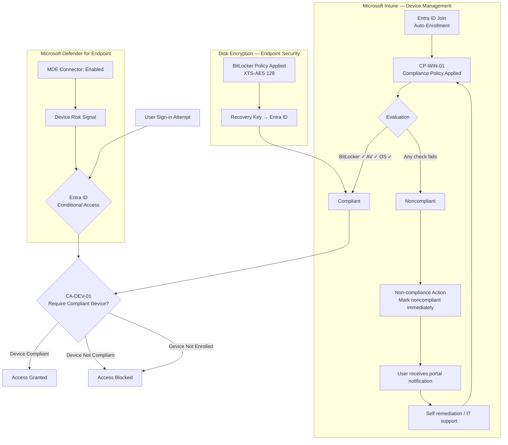
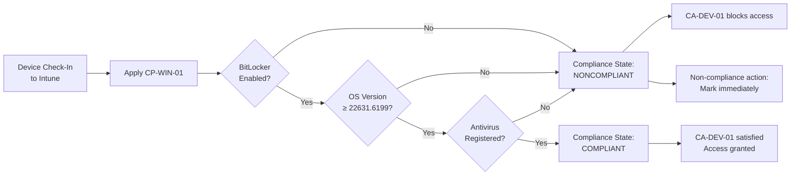
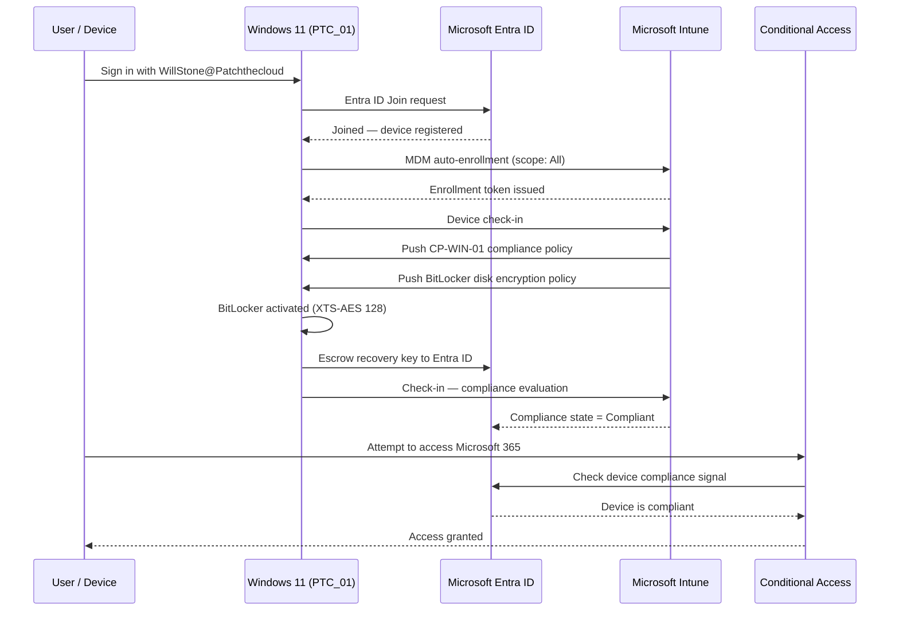
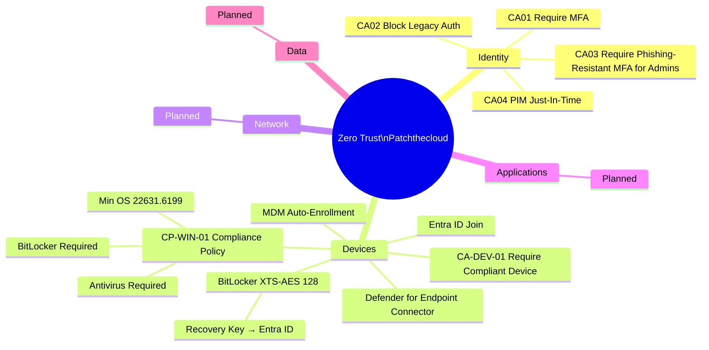

# Architecture Diagrams — Zero Trust Device Trust Enforcement

---

## Diagram 1: Device Trust Enforcement — High-Level Flow



---

## Diagram 2: Compliance Evaluation Logic



---

## Diagram 3: Entra ID Join and MDM Auto-Enrolment Sequence



---

## Diagram 4: Zero Trust Pillars — Device Layer Context



---

## Diagram 5: Deployment Timeline

```mermaid
gantt
    title Project 2 — Zero Trust Device Trust Enforcement
    dateFormat  YYYY-MM-DD
    section Enrolment
        Entra ID Join PTC_01         :done, e1, 2026-01-05, 1d
        MDM Auto-Enrollment (All)    :done, e2, 2026-01-05, 1d
    section Compliance
        Create CP-WIN-01             :done, c1, 2026-01-06, 1d
        Assign to All Devices        :done, c2, 2026-01-06, 1d
        Verify noncompliant state    :done, c3, 2026-01-07, 1d
    section Encryption
        Deploy BitLocker policy      :done, enc1, 2026-01-07, 1d
        Recovery key escrow confirmed :done, enc2, 2026-01-08, 1d
        Device reaches Compliant     :done, enc3, 2026-01-08, 1d
    section Defender
        Enable MDE-Intune connector  :done, mde1, 2026-01-09, 1d
        Confirm Connection: Enabled  :done, mde2, 2026-01-09, 1d
    section CA Enforcement
        CA-DEV-01 Report-only        :done, ca1, 2026-01-09, 2d
        Validate CA signal           :done, ca2, 2026-01-10, 1d
        CA-DEV-01 Enforced           :done, ca3, 2026-01-10, 1d
```
